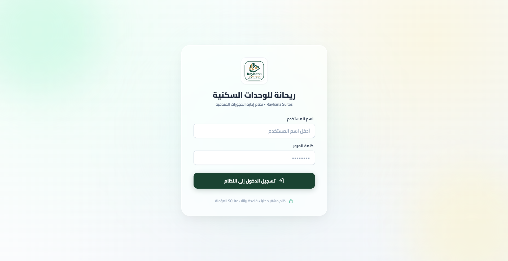
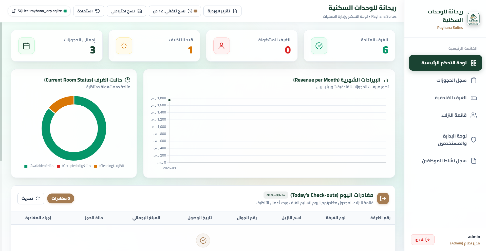
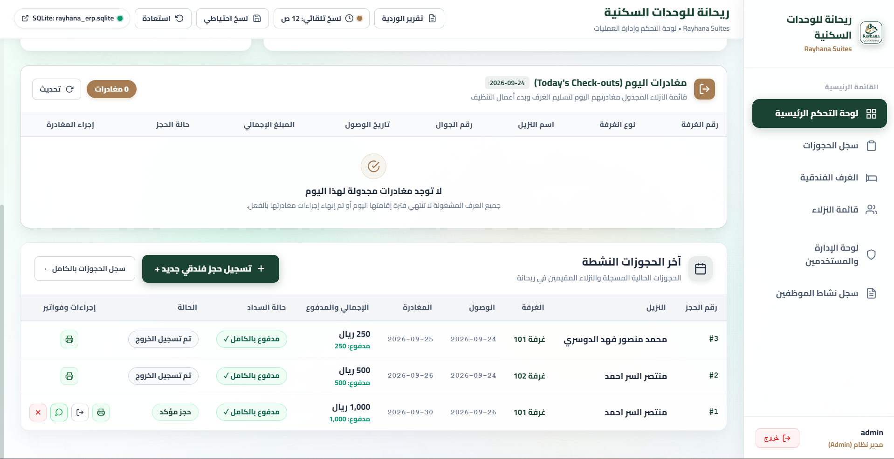
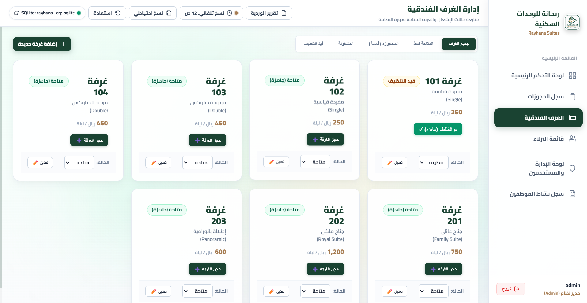
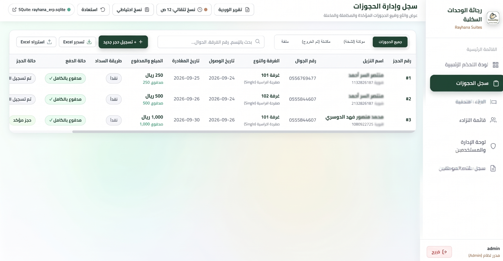

# نظام ريحانة لإدارة الفنادق (Rayhana ERP)

منظومة سطح مكتب محلية متكاملة (Serverless) لإدارة الفنادق والضيافة، تعمل عبر **Electron.js** وقاعدة بيانات **SQLite3** مع واجهة مستخدم عربية بالكامل تدعم **RTL**.

---

## 🌟 الميزات والمواصفات المتقدمة

1. **التحكم بالصلاحيات والأمان (RBAC - Role-Based Access Control):**
* مستويات الصلاحيات: **مدير نظام (Admin)** وموظف استقبال **(Staff)**.
* **لوحة إدارة مخصصة تظهر فقط للمدير (Admin Panel):**
* إنشاء حسابات مستخدمين جديدة وتعيين دور الصلاحية لهم (`Admin` أو `Staff`).
* تغيير كلمة المرور الخاصة بحساب المدير.
* استعراض وحذف المستخدمين.


2. **الرسوم البيانية والتحليلات (Chart.js Analytics):**
* **رسم بياني شريطي (Bar Chart):** يوضح نمو الإيرادات الشهرية للفندق.
* **رسم بياني دائري (Doughnut Chart):** يوضح توزيع حالات الغرف الحالية (متاحة، مشغولة، قيد التنظيف) بصرياً وفورياً.


3. **استيراد وتصدير ملفات Excel (بواسطة SheetJS `xlsx`):**
* **تصدير:** تنزيل جدول الحجوزات أو جدول النزلاء بنقرة واحدة إلى ملف `.xlsx` منسق.
* **استيراد جماعي:** إمكانية رفع ملفات Excel لإضافة النزلاء والحجوزات دفعة واحدة إلى قاعدة بيانات SQLite.


4. **إدارة الغرف وحالاتها الفورية:**
* بطاقات تفاعلية لتغيير حالة الغرف بنقرة واحدة (`متاحة`، `مشغولة`، `تنظيف`).
* إضافة غرف فندقية جديدة بأنواع وأسعار متعددة.


5. **واجهة عربية 100% (RTL):**
* تصميم مكتبي عصري، سريع وخالٍ من الاعتماد على أي خوادم خارجية (Offline-First).
* محرك SQLite WebAssembly فائق السرعة متوافق بالكامل مع أنظمة التشغيل المختلفة.


6. **نظام النسخ الاحتياطي التلقائي:**
* جدول نسخ احتياطي مدمج لحماية بيانات الفندق بشكل دوري وتأمينها من الفقدان.


---

## 🔑 حسابات الدخول الافتراضية

* **حساب المدير (Admin):**
* اسم المستخدم: `admin`
* كلمة المرور: `admin`
* الصلاحيات: صلاحيات كاملة + لوحة الإدارة والمستخدمين.


* **حساب موظف الاستقبال (Staff):**
* اسم المستخدم: `staff`
* كلمة المرور: `staff`
* الصلاحيات: إدارة الحجوزات والغرف والنزلاء (مع حجب لوحة الإدارة).


---

## 🚀 تشغيل التطبيق في بيئة التطوير

1. افتح موجه الأوامر (Terminal أو PowerShell) داخل مجلد المشروع:
```bash
cd rayhana-erp

```


2. تشغيل التطبيق مباشرة:
```bash
npm start

```


---

## 📦 بناء وتجميع البرنامج ليعمل كملف تنفيذي

لبناء برنامج التثبيت والنسخة المحمولة (Portable) للعمل على أنظمة Windows:

```bash
npm run build

```

*(أو `npm run dist` أو `npm run builder`)*

بعد انتهاء عملية البناء، ستجد الملفات الجاهزة داخل مجلد `dist/`:

* **`dist/Rayhana ERP Setup 1.0.0.exe`**: برنامج تثبيت قياسي كامل لنظام Windows مع اختصارات سطح المكتب وقائمة ابدأ.
* **`dist/Rayhana ERP 1.0.0.exe`**: نسخة محمولة (Portable) تعمل مباشرة بنقرة واحدة دون الحاجة لتثبيت.

---

## 🗄 مسار ملف قاعدة بيانات SQLite

يتم حفظ قاعدة البيانات محلياً في المسار التالي لضمان عدم فقدان البيانات عند تحديث البرنامج وإصدار نسخ جديدة:

```
%APPDATA%\rayhana-erp\rayhana_erp.sqlite

```

*(يمكنك النقر على زر قاعدة البيانات في الشريط العلوي للتطبيق لفتح المجلد مباشرة في النظا)*







