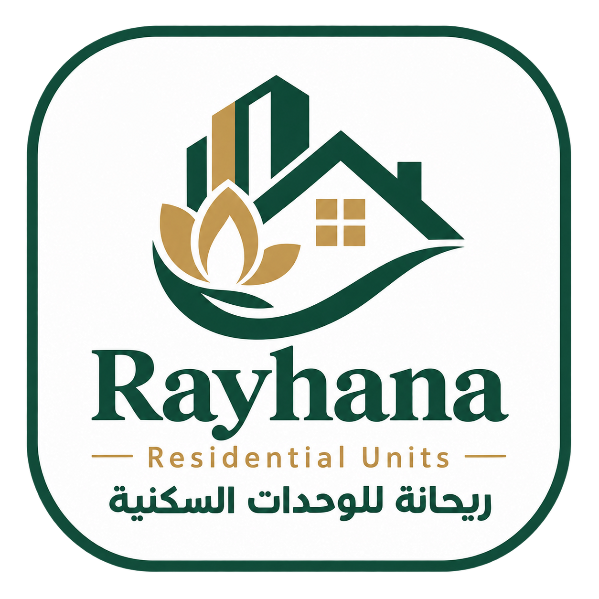

# Rayhana ERP | ريحانة للوحدات السكنية والفنادق

<div align="center">



### **نظام إدارة الفنادق والشقق الفندقية المتكامل (Desktop ERP)**
**An Enterprise-Grade, RTL-First Hospitality & Property Management System built with Electron, Node.js & SQLite**

[](https://www.electronjs.org/)
[](https://nodejs.org/)
[](https://sqlite.org/)
[](https://microsoft.com)
[](LICENSE)
[](#)

</div>

---

## 📌 جدول المحتويات | Table of Contents
- [📖 عن النظام (Overview)](#-عن-النظام-overview)
- [✨ المميزات والأنظمة الفرعية (Core Features)](#-المميزات-والأنظمة-الفرعية-core-features)
- [⚡ لوحة الأوامر الذكية (Smart Command Palette - Ctrl + K)](#-لوحة-الأوامر-الذكية-smart-command-palette---ctrl--k)
- [🏗️ البنية التقنية (Architecture & Tech Stack)](#️-البنية-التقنية-architecture--tech-stack)
- [📂 هيكل المشروع (Project Directory Tree)](#-هيكل-المشروع-project-directory-tree)
- [🚀 التثبيت والتشغيل المحلي (Getting Started)](#-التثبيت-والتشغيل-المحلي-getting-started)
- [📦 بناء ملف التثبيت لويندوز (Building NSIS Installer)](#-بناء-ملف-التثبيت-لويندوز-building-nsis-installer)
- [🧪 الاختبارات وضمان الجودة (Testing & QA)](#-الاختبارات-وضمان-الجودة-testing--qa)
- [💾 النسخ الاحتياطي والأمان (Backup & Disaster Recovery)](#-النسخ-الاحتياطي-والأمان-backup--disaster-recovery)
- [English Summary](#-english-summary)

---

## 📖 عن النظام (Overview)

**نظام ريحانة (Rayhana ERP)** هو تطبيق مكتبي عالي الكفاءة مخصص لإدارة الفنادق، الأجنحة الفندقية، والشقق المفروشة. صُمم النظام بالكامل ليعمل محلياً (Offline-First) بأعلى درجات الأمان والسرعة، مع واجهة مستخدم عربية احترافية من اليمين لليسار (RTL) تدعم سير العمل الفندقي الحقيقي: من التسكين السريع، الجرد الليلي ومحاسبة الوردية، إلى إصدار الفواتير وسندات القبض ومراسلة النزلاء عبر واتساب.

### 🎯 أهداف التصميم
- **السرعة الفائقة:** إنجاز كافة العمليات دون مغادرة لوحة المفاتيح عبر لوحة الأوامر الذكية (`Ctrl + K`).
- **الموثوقية المحاسبية:** منع أي تضارب مالي أو كسور غير متطابقة في العقود والتسويات الضريبية.
- **التوافق الفندقي الواقعي:** دعم حجوزات ما بعد منتصف الليل، الساعات النهارية (Day-Use)، وإبطال حجز اليوم (Void).
- **الحماية والخصوصية:** قاعدة بيانات محلية مشفرة بالكامل بدون أي اعتمادية إجبارية على الإنترنت.

---

## ✨ المميزات والأنظمة الفرعية (Core Features)

### 1. 🛏️ شبكة الغرف التفاعلية (Visual Room Grid)
- عرض فوري لحالة كل غرفة بترميز لوني معتمد:
  - 🟢 **متاحة:** جاهزة للتسكين الفوري بنقرة واحدة.
  - 🔴 **مشغولة:** تعرض اسم النزيل والرصيد المتبقي أو الدائن.
  - 🟡 **قيد التنظيف:** تتطلب تأكيد النظافة قبل إتاحتها.
  - 🔵 **محجوزة:** مخصصة لقادمين في تاريخ لاحق.
- تصفية فورية حسب الطابق (الدور) أو الحالة التشغيلية.

### 2. 📋 إدارة التسكين والحجوزات (Check-in & Reservations)
- دعم كافة أنماط الإقامة: **يومي، شهري، واستخدام يومي (Day-Use)**.
- **معالجة ساعات الفجر وما بعد منتصف الليل:** احتساب الليلة بدقة حسب تاريخ الأعمال الفندقي (Business Day) وليس التاريخ المدني فقط.
- التحقق التلقائي من الهوية ورقم الجوال وسجل النزيل السابق.

### 3. 🚪 المغادرة والتسوية المالية الذكية (Checkout & Settlement)
- احتساب تلقائي لصافي المستحق، المبالغ المدفوعة مسبقاً، والخصومات المعتمدة.
- استرداد أو تسوية مبالغ التأمين النقدي بدقة.
- **حماية تضارب قيمة العقد:** منع إتمام الخروج عند وجود تضارب بين بنود العقد ومعادلة التسوية لضمان نزاهة الحسابات.

### 4. ❌ إبطال حجز اليوم والتراجع السريع (Walk-in Void)
- إمكانية إلغاء حجز خاطئ تم في نفس اليوم (Walk-in) وإعادة الغرفة لمتاحة فوراً واسترداد المبالغ دون تشويه التقارير المحاسبية التاريخية.

### 5. 🧾 الفواتير والمدفوعات والواتساب (Invoicing & Receipts)
- إصدار فواتير ضريبية مفصلة تتضمن تفقيط المبالغ والضريبة المضافة.
- إصدار سندات قبض رسمية لكل دفعة مع تتبع وسيلة الدفع (كاش، شبكة، تحويل بنكي).
- **تكامل واتساب المباشر:** إرسال رسائل ترحيبية وملخص الحجز والفاتورة للنزيل بنقرة واحدة.

### 6. 🌙 الجرد الليلي وتاريخ الأعمال (Night Audit & Business Day)
- جدولة تدوير تاريخ الأعمال التشغيلي فندsupportياً.
- تتبع الإشغال اليومي، متوسط سعر الليلة (ADR)، والإيراد لكل غرفة متاحة (RevPAR).

### 7. 📊 تقرير الوردية وجرد الدرج (Shift Management & Cash Drawer)
- تقفيل الوردية ومطابقة النقدية الفعلية مع المسجل بالنظام.
- كشف أي عجز أو زيادة في الكاش وحفظ تقرير رسمي لكل مناوبة.

### 8. ⛔ سجل النزلاء والقائمة السوداء (Guest CRM & Blacklist)
- فهرس كامل للنزلاء، سجل الإقامات، والبيانات الشخصية.
- **نظام الحظر التلقائي:** منع تسكين أي نزيل مسجل في القائمة المحظورة مع إظهار سبب الحظر فورياً.

---

## ⚡ لوحة الأوامر الذكية (Smart Command Palette - Ctrl + K)

محرك تحكم مركزي يتيح تنفيذ العمليات الفندقية خلال ثوانٍ معدودة من لوحة المفاتيح:

```
[ Ctrl + K ] ➔ افتح اللوحة من أي مكان
```

### 🏷️ 1. رموز البادئة السريعة (Prefix Shortcuts)
| البادئة | الوظيفة | مثال | الإجراء |
| :---: | :--- | :--- | :--- |
| **`#`** | **رقم الحجز** | `#105` | استعراض العقد، الفاتورة، أو إضافة سند قبض. |
| **`@`** | **سجل النزلاء** | `@محمد` أو `@050...` | البحث في النزلاء مع زر «إنشاء حجز لهذا النزيل» وتعبئة بياناته تلقائياً. |
| **`!`** أو **`ق`** أو **`r`** | **استعلام الغرفة** | `!204` أو `ق204` | بطاقة تفاصيل الغرفة، النزيل، الرصيد، وأزرار سريعة للعمليات. |

### 🔄 2. مرونة الترتيب مع أرقام الغرف
يقبل النظام كتابة الرقم **قبل أو بعد** العملية، مع أو بدون مسافات:
- `فاتورة 205` ⟵ ⟶ `205 فاتورة` (فتح الفاتورة الضريبية)
- `تسكين 101` ⟵ ⟶ `101 تسكين` أو `حجز 101` (تسكين الغرفة)
- `سند 103` ⟵ ⟶ `103 سند` أو `قبض 103` أو `قبض103` (سند قبض مالي)
- `تمديد 204` ⟵ ⟶ `204 تمديد` (تمديد إقامة النزيل)
- `واتساب 204` ⟵ ⟶ `204 واتساب` (محادثة واتساب مباشرة)
- `204` أو `مين في 204` (استعلام الغرفة والنزيل المقيم)

### 🏢 3. الأوامر المباشرة والتقارير الفورية
- **الوردية والكاش:** `وردية`، `درج`، `كاش`، `فلوس الدرج`، `صندوق`.
- **الديون والمستحقات:** `ديون`، `مستحق`، `غير مدفوع`، `مين عليه فلوس`.
- **المغادرات والمتأخرون:** `مغادرات`، `خروج اليوم`، `متأخرين`.
- **حالات الغرف:** `متاح`، `فاضية`، `مشغول`، `تنظيف`.
- **الأدوار:** `طابق 1`، `الدور 2`، `طابق 3`.
- **الإدارة:** `محظورين`، `بلاك ليست`، `نسخ احتياطي`.

### 🤖 4. الذكاء الاصطناعي ومقاومة الأخطاء المطبعية
- **⚡ الإكمال التلقائي (Prefix Autocompletion):** اكتب `فا` أو `تسك` أو `ور`، وستظهر بطاقات الاقتراحات؛ اضغط <kbd>Tab</kbd> أو <kbd>Enter</kbd> للإكمال أو التنفيذ الفوري.
- **🛡️ تصحيح الأخطاء (Typo Resilience):** لو كتبت `تسيكن 101` أو `فتوره 205` يتعرف النظام على قصدك فوراً ويعرض شريط تنبيه مع خيار البحث عن النص الأصلي.
- **🌐 تصحيح لغة الإدخال (EN ➔ AR):** لو كتبت بالخطأ والأحرف إنجليزية (مثل `thj,vi 205`) يتم تحويلها إلى `فاتورة 205` وتنفيذها تلقائياً.

---

## 🏗️ البنية التقنية (Architecture & Tech Stack)

```
┌────────────────────────────────────────────────────────┐
│                   Rayhana ERP Desktop                  │
├────────────────────────────────────────────────────────┤
│  Frontend Layer (Electron Renderer)                    │
│  - HTML5 / Vanilla Modular JavaScript (RTL)            │
│  - Design Tokens CSS (Typography, Spacing, Themes)     │
│  - Chart.js (Occupancy & Revenue Visualizations)       │
│  - Command Palette Engine (WeakMap Indexing & Levenshtein)
├────────────────────────────────────────────────────────┤
│  Security & Preload Bridge                             │
│  - Context Isolation: ON                               │
│  - Node Integration: OFF (Safe window.api IPC Bridge)  │
│  - Role-Based Access Control (Admin vs Staff)          │
├────────────────────────────────────────────────────────┤
│  Backend & Data Layer (Electron Main Process)          │
│  - Node.js 18+ Runtime                                 │
│  - SQLite (sql.js) with Atomic Transactions & WAL      │
│  - bcryptjs (Cryptographic Password Hashing)           │
│  - SheetJS / xlsx (Excel Data Import/Export)           │
│  - Automated 12:00 AM Daily Backup Scheduler           │
│  - Business Day Night Audit Rollover Scheduler         │
└────────────────────────────────────────────────────────┘
```

---

## 📂 هيكل المشروع (Project Directory Tree)

```text
Rayhana-ERP/
├── assets/                  # الأيقونات والوسائط الثابتة
├── db/                      # طبقة قاعدة البيانات والـ Migrations
│   ├── index.js             # تهيئة قاعدة البيانات والاتصال
│   └── schema.sql           # مخطط الجداول والفهارس
├── ipc/                     # معالجات قنوات IPC بين العمليات
│   ├── auth.js              # توثيق المستخدمين والصلاحيات
│   ├── rooms.js             # عمليات الغرف وحالاتها
│   ├── reservations.js      # الحجوزات والتسكين والتمديد
│   ├── invoices.js          # الفواتير وسندات القبض
│   ├── guests.js            # سجل النزلاء والحظر
│   └── reports.js           # تقارير الورديات والإيرادات
├── scripts/                 # سكريبتات التشغيل والصيانة والنسخ
│   ├── baseline.js          # فحص استقرار الشيفرة البرمجية
│   ├── refactor-guard.js    # حماية ضد التغييرات غير المقصودة
│   ├── daily_backup_12am.bat# تشغيل النسخ التلقائي
│   └── register_windows_task.ps1 # تسجيل مهمة ويندوز المجدولة
├── tests/                   # منظومة الاختبارات الوظيفية والوحدات
├── backupScheduler.js       # مجدول النسخ الاحتياطي اليومي 12:00 AM
├── businessDayScheduler.js  # مجدول تدوير يوم الأعمال الفندقي
├── command-palette.js       # محرك لوحة الأوامر الذكية (Ctrl + K)
├── dashboard.html           # الواجهة الرئيسية ولوحة التحكم
├── dashboard.js             # منطق الشاشة الرئيسية ومعالجة الأحداث
├── design-tokens.css        # نظام التصميم والمتغيرات المرئية
├── main.js                  # نقطة انطلاق التطبيق وإدارة النوافذ
├── preload.js               # جسر الأمان بين الـ Renderer والـ Main
├── package.json             # الحزم والمكتبات وسكريبتات البناء
└── README.md                # دليل المشروع والتوثيق المرجعي
```

---

## 🚀 التثبيت والتشغيل المحلي (Getting Started)

### متطلبات التشغيل (Prerequisites)
- **نظام التشغيل:** Windows 10 أو Windows 11 (64-bit)
- **بيئة Node.js:** الإصدار 18 أو أحدث ([تحميل Node.js](https://nodejs.org/))
- **مدير الحزم:** `npm` (مرفق مع Node.js)

### خطوات التثبيت والتشغيل:
1. **استنساخ المستودع (Clone):**
   ```bash
   git clone https://github.com/your-username/Rayhana-ERP.git
   cd Rayhana-ERP
   ```

2. **تثبيت الحزم البرمجية (Dependencies):**
   ```bash
   npm install
   ```

3. **تهيئة قاعدة البيانات الأولية (Reset / Seed DB):**
   ```bash
   npm run reset-db
   ```

4. **تشغيل التطبيق في وضع التطوير (Development):**
   ```bash
   npm start
   ```

---

## 📦 بناء ملف التثبيت لويندوز (Building NSIS Installer)

لإنشاء حزمة التثبيت الرسمية (`.exe`) القابلة للتنصيب على أجهزة الاستقبال:

```bash
# إنشاء حزمة التثبيت المستقلة
npm run dist
```
أو لبناء مجلد التطبيق المباشر بدون مثبت (Portable / Directory):
```bash
npm run pack
```

- يتم حفظ الملف الناتج في مجلد `dist/`:
  - `dist/Rayhana-Suites-Setup-2.0.0.exe` (مثبت احترافي NSIS مع إنشاء اختصار لسطح المكتب وقائمة ابدأ).

---

## 🧪 الاختبارات وضمان الجودة (Testing & QA)

يحتوي النظام على حزمة اختبارات شاملة تغطي العمليات المالية، التسكين، والنزاهة المحاسبية:

```bash
# تشغيل الفحص السريع الشامل (Lint + Baseline + Guard + Unit Tests)
npm run test:quick

# تشغيل اختبارات الوحدات (Unit Tests) فقط
npm run test:unit

# فحص المعايير البرمجية والأسلوب (ESLint)
npm run lint

# فحص الاعتماديات الدائرية (Circular Dependencies)
npm run circular

# فحص حماية الشيفرة ضد التعديلات غير المصرح بها
npm run guard
```

---

## 💾 النسخ الاحتياطي والأمان (Backup & Disaster Recovery)

1. **النسخ الآلي اليومي (In-App Automated Backup):**
   - يعمل تلقائياً كل ليلة الساعة **12:00 منتصف الليل (12:00 AM)**.
   - يحفظ نسخة مشفرة من قاعدة البيانات في:
     `%APPDATA%\rayhana-suites\backups\`
   - يحفظ نسخة مرآة إضافية في مجلد المستندات:
     `%USERPROFILE%\Documents\Rayhana_Backups\`
   - **آلية التعويض عند الإغلاق (Catch-up):** إذا كان الجهاز مغلقاً وقت منتصف الليل، يقوم النظام بإنشاء نسخة فورية عند أول فتح صباحاً.
   - تدوير تلقائي يحفظ آخر 60 يوماً من النسخ.

2. **التسجيل في مهام ويندوز (Windows Task Scheduler):**
   - لتشغيل النسخ حتى بدون فتح البرنامج، شغّل السكريبت كمسؤول:
     ```powershell
     powershell -ExecutionPolicy Bypass -File .\scripts\register_windows_task.ps1
     ```

---

## 🌐 English Summary

**Rayhana ERP** is a modern, reliable, and secure desktop Property Management System (PMS) tailored for hotels, residential units, and furnished suites. 

### Key Highlights:
- **Offline-First Desktop App**: Powered by Electron 29 and local SQLite database (`sql.js`), guaranteeing high performance and zero external downtime.
- **RTL-First Arabic UI**: Crafted with care for Arabic-speaking hotel front-desk operations.
- **Smart Command Palette (`Ctrl + K`)**: Keyboard-driven command center featuring AI typo resilience, prefix autocompletion, number-action reordering, and direct symbol shortcuts (`#` for reservations, `@` for guests, `!` for rooms).
- **Hospitality Workflows**: Comprehensive night audit, business-date rollover, day-use reservations, early checkout settlements, cash drawer shift handovers, and VAT-compliant invoicing.
- **Automated Disaster Recovery**: Scheduled 12:00 AM daily SQLite backups with mirror replication and catch-up mechanism.

---

## 📄 الترخيص والحقوق (License & Rights)

هذا المشروع مرخص بموجب رخصة **MIT**. لمزيد من التفاصيل، راجع ملف [LICENSE](LICENSE).

<div align="center">
  <sub>صُنع بعناية فائقة لقطاع الضيافة والشقق السكنية © Rayhana Management</sub>
</div>